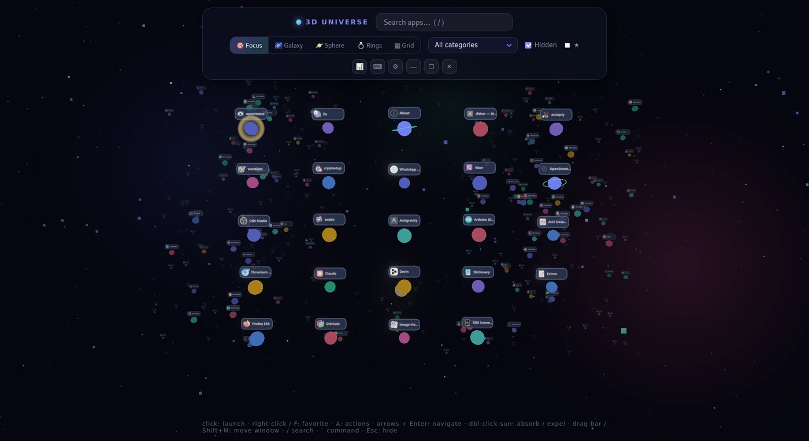
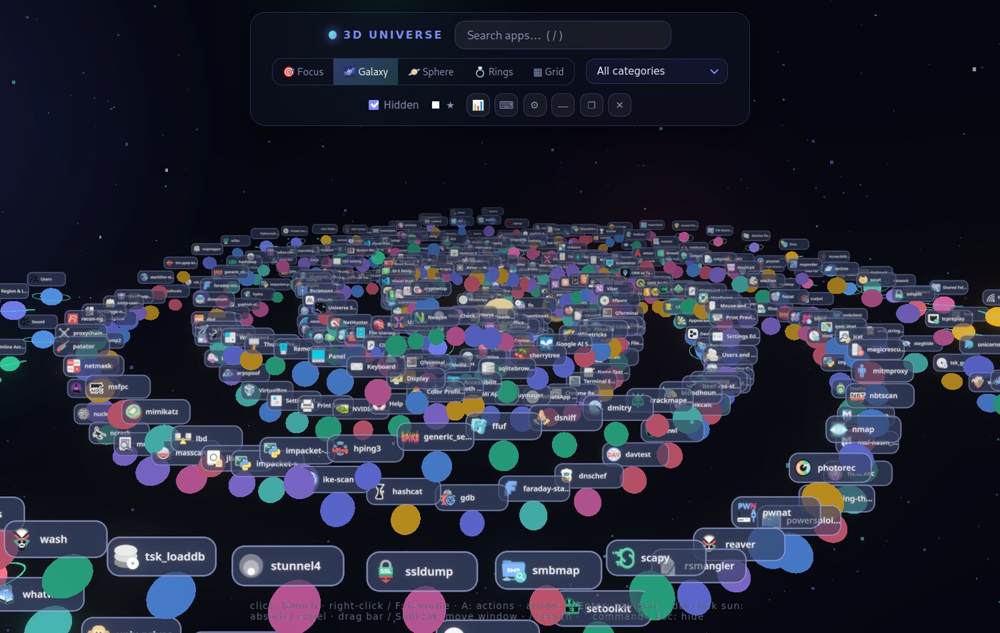
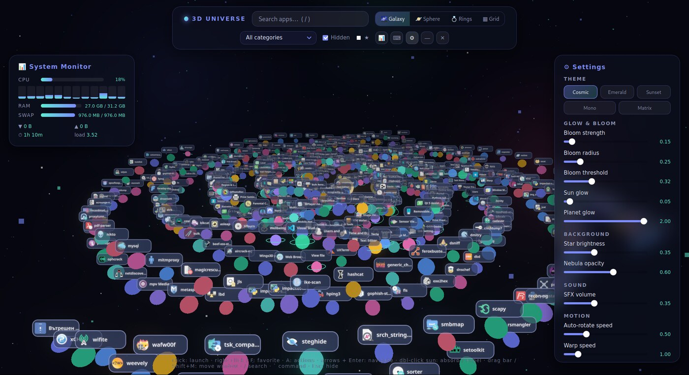

<div align="center">

# Universe 3D

**A 3D application launcher for Linux.**

Every installed application becomes a glowing planet in an interactive universe
you can search, sort and fly through.

[](https://github.com/Nurkan1/Universe-3D-Linux/actions/workflows/ci.yml)
[](https://github.com/Nurkan1/Universe-3D-Linux/releases/latest)
[](LICENSE)
[](https://tauri.app)
[](#requirements)



</div>

---

## Overview

Universe 3D reads every `.desktop` entry on your system — including the hidden
ones (`NoDisplay=true`) that normal menus omit — and renders them as planets in
a navigable 3D scene. It is built with [Tauri 2](https://tauri.app) and
[Three.js](https://threejs.org): a Rust backend does the scanning and launching,
a WebGL frontend does the rendering.

It runs as a tray daemon, so summoning it with a hotkey is instant.

## Features

**Navigation**
- **Focus layout** (default) — depth carries meaning rather than decoration:
  the apps you actually use sit in a readable grid at the front, everything
  else recedes, shrinking and dimming with distance
- Four more layouts: spiral galaxy, sphere, category rings and grid
- Fuzzy search (`/`) — typing `gimp` finds *GNU Image Manipulation Program*
- Keyboard navigation with arrow keys, `Enter` to launch
- Global hotkey (`Super+Space`) to summon or dismiss the window
- Warp animation on launch, and a black-hole effect on the sun

**Organisation**
- Favourites (`F` or right-click) pinned into the innermost orbits
- Usage-aware ordering that blends launch frequency with recency
- Category filter, favourites-only mode, and a toggle for hidden apps
- Desktop-entry actions (`A`) such as Firefox's *New Private Window*

**Utilities**
- Command launcher (`` ` ``) with history and an explicit confirmation step
- Live system monitor: per-core CPU, RAM, swap, network throughput and load
- Five themes and adjustable bloom, starfield, nebula and motion settings

## The Focus layout

Most 3D desktops failed because the third dimension was decoration — it added
depth without adding information. Focus uses it as data instead.

Depth encodes **relevance**. The applications you actually launch are laid out
in an ordered grid at the front, full size and fully legible. Everything else
recedes into the background, shrinking and dimming with distance. It stays
present, still clickable and still found by search, but it stops competing for
attention.

Seen head-on it reads as an ordinary, ordered launcher. The depth is what tells
you, at a glance, which of several hundred applications matter — something a
flat list cannot show without hiding things behind a scrollbar.

Ranking blends launch frequency with recency. On a fresh install, with no usage
history yet, it falls back to signals from the desktop entries themselves so
the front grid is useful from the first run.

The difference is easier to see than to describe. The same machine, the same
few hundred applications, in Galaxy and in Focus:

<div align="center">



*Galaxy — spectacular, and unreadable once the labels overlap.*


*Focus — the same apps, legible up front, everything else receding.*

</div>

## Screenshots

<div align="center">



*The live system monitor and the settings panel, open over the galaxy layout.
Five themes, adjustable bloom, starfield and motion.*

</div>

## Install

Grab a build from the [latest release](https://github.com/Nurkan1/Universe-3D-Linux/releases/latest):

**Debian / Ubuntu / Kali**

```bash
sudo dpkg -i universe-3d_*_amd64.deb
```

**AppImage** — any distribution, nothing to install:

```bash
chmod +x universe-3d_*_amd64.AppImage
./universe-3d_*_amd64.AppImage
```

Every release ships a `SHA256SUMS.txt`; verify a download with
`sha256sum -c SHA256SUMS.txt`.

To build from source instead, see [Building](#building).

## Requirements

- **Rust** (stable) and **Node.js** 18+
- WebKitGTK and GTK development libraries:

```bash
sudo apt install libwebkit2gtk-4.1-dev libgtk-3-dev \
                 libayatana-appindicator3-dev librsvg2-dev libxdo-dev \
                 build-essential curl wget file pkg-config
```

If you do not have Rust:

```bash
curl --proto '=https' --tlsv1.2 -sSf https://sh.rustup.rs | sh
```

## Quick start

```bash
git clone https://github.com/Nurkan1/Universe-3D-Linux.git
cd Universe-3D-Linux
npm install
npm run dev
```

## Building

```bash
npm run build
```

Bundles land in `src-tauri/target/release/bundle/`:

```bash
# Debian / Ubuntu / Kali — installs the binary, icons and menu entry
sudo dpkg -i "src-tauri/target/release/bundle/deb/Universe 3D_"*_amd64.deb

# or the portable AppImage
chmod +x src-tauri/target/release/bundle/appimage/*.AppImage
```

The `.deb` registers the app in your application menu (`Exec=universe-3d`), so
no manual `.desktop` file is needed.

## Keyboard shortcuts

| Key | Action |
|---|---|
| `Super+Space` | Show / hide the universe (global, configurable) |
| `/` | Search |
| `` ` `` | Command launcher |
| `A` | Desktop-entry actions for the focused app |
| `F` / right-click | Toggle favourite |
| `↑ ↓ ← →` | Move between planets |
| `Enter` | Launch the focused app |
| `Shift+M` | Move the window to the next monitor |
| `Esc` | Close panel / hide the window |
| Double-click the sun | Absorb / expel the planets |

## Configuration

Preferences live in `~/.config/universe-3d/prefs.json` — favourites, recents,
launch counts, command history, theme and visual settings. To change the global
hotkey, add a `hotkey` key:

```json
{ "hotkey": "Super+D" }
```

The icon index is cached in `~/.cache/universe-3d/icon-index.json` and rebuilt
only when the system icon directories change.

## Architecture

```
src-tauri/src/main.rs      Tauri commands: launching, monitor, prefs, window,
                           tray and the global hotkey
src-tauri/src/desktop.rs   .desktop scanning, actions, cached icon resolution
src/renderer/universe.js   3D scene, layouts, interaction
src/renderer/tauri-bridge.js  invoke() bridge between the UI and Rust
scripts/vendor-three.sh    vendors the JS dependencies into the renderer
```

There is no bundler. `npm run dev` and `npm run build` run
`scripts/vendor-three.sh`, which copies Three.js and `@tauri-apps/api` from
`node_modules/` into `src/renderer/vendor/` (gitignored); the webview imports
them through a relative importmap. If you build with `cargo` directly, run that
script first.

## Security

Launching applications and running commands are the sensitive paths, so they
are handled deliberately:

- **Applications are launched without a shell.** A `.desktop` file's `Exec=`
  line is parsed into `argv` per the XDG specification and executed directly,
  so shell metacharacters in an untrusted entry stay inert. Covered by unit
  tests, including that case.
- **The webview runs under a restrictive CSP** with `withGlobalTauri` disabled,
  so injected scripts cannot reach `invoke` through a browser global.
- **The command launcher does use a shell** — that is its purpose — but only
  after showing the exact command and requiring an explicit confirmation.
- **Nothing leaves the machine.** The app makes no network requests; all assets
  are local and the CSP forbids remote ones.

Found a security issue? Please open an issue, or report it privately through
GitHub's security advisories.

## Contributing

Contributions are welcome. CI runs `cargo fmt --check`, `cargo clippy -D
warnings` and `cargo test`, so please make sure those pass locally:

```bash
cd src-tauri
cargo fmt --all
cargo clippy --all-targets -- -D warnings
cargo test
```

## License

[MIT](LICENSE) © Nurkan1
